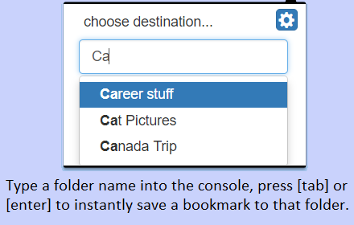

## BookMap

### [Available Now: Get the chrome extension!](https://chrome.google.com/webstore/detail/bookmap/gdbkjigmeiednmbhllknejncmoklabne) Version 1.234 Beta

Chrome extension designed to significantly decreases the time it takes to save a bookmark to a desired folder.

*Highly recommended you set up hotkeys before using.*

- Open the console and begin typing a folder name. When your target folder is selected press tab or enter to add a bookmark to it.

- There are also 4 hot-keys that you can assign to folders for instant book mark creation.

#### FAQ

1) Why does this extension ask to use my history? - History is coupled with tab access in chrome. If you view the code you'll see there's no interaction with your history whatsoever :]

2) Why only 4 hotkeys? - This is currently the max hotkeys allowed on a chrome extension. If there's demand it's possible BookMap could be recreated as Chrome App to make more mapping available.

3) What's next? - After some UI improvement, BookMap will be getting pop-up notifications to provide additional feedback upon creating a bookmark.

